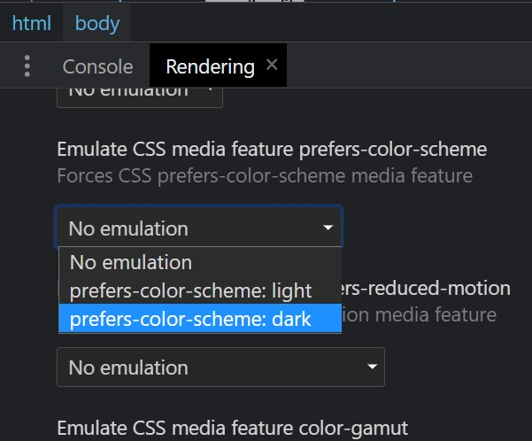

<!-- Começo/ Apresentação -->
<h1 align="center">📚 Calculadora 📊</h1>
<h3 align="center"> ⚡ <a href="https://igorcbraz.github.io/Calculadora/" target="_blank">Calculadora</a> Responsiva e com opções para troca de temas ⚡</h3>

<!-- Imagens do Projeto -->
<div align="center">
 <br>
<!-- Atribuições-->
Desafio feito por <a href="https://www.frontendmentor.io/challenges/calculator-app-9lteq5N29"><em>Frontend Mentor</em></a>
</div>

<hr></hr>    
    
<h2 align="left">🌗  Prefer Color Scheme:</h2>
<p>Além dos 3 diferentes temas da calculadora, foi usado o recurso de mídia <a href="https://developer.mozilla.org/en-US/docs/Web/CSS/@media/prefers-color-scheme" target="_blank"><code>prefer-color-scheme</code></a>.</p>

<p>Esse recurso possibilita o entendimento de qual a preferência do usuário em relação aos temas, assim podendo receber dois valores:</p>

<ul>
<li>Light (Claro)</li>
<li>Dark (Escuro)</li>
</ul>

<p>A maneira de aplicar esse recurso de acordo com a developer.mozilla é da seguinte maneira:</p>

```
@media (prefers-color-scheme: dark) {
  // Configurações CSS para o tema dark
}

@media (prefers-color-scheme: light) {
  // Configurações CSS para o tema light
}
```
<p>Mas com esse método o carregamento do código irá ficar mais lento pois seria necessário repetir todas as propriedades desejadas com suas novas colorações.</p>
<h3>Então qual a solução ? 🤔</h3>
<p>Iremos apenas mudar os valores das variáveis do CSS com JS.</p>

```
const darkThemeMq  = window.matchMedia("(prefers-color-scheme: dark)");
const lightThemeMq = window.matchMedia("(prefers-color-scheme: light)");
```
<p>Primeiro identificamos qual a preferência de tema do usúario e guardamos o resultado em uma constante.</p>
<p>Agora só precisamos verificar qual o valor das constantes e modificar os valores das variáveis do CSS</p>

```
if (darkThemeMq.matches) {
    document.getElementById('btnTheme').value = "3";
    theme.dark();
} else if(lightThemeMq.matches){
    document.getElementById('btnTheme').value = "2";
    theme.light();    
} else {
    document.getElementById('btnTheme').value = "1";
    theme.defaul();    
}
```
<p>theme.dark(),theme.light()... Armazenam os comandos para modificar os valores das variáveis no CSS. Sendo eles:</p>

```
const theme = {
    defaul(){
        root.style.setProperty('--background'          , '#3a4764');
        // E as demais variavéis
    },
    light(){
        root.style.setProperty('--background'          , '#e6e6e6');
        // E as demais variavéis
    },
    dark(){
        root.style.setProperty('--background'          , '#17062a');
        // E as demais variavéis
    }
}

// Get the root element
var root = document.querySelector(':root');
```

<h3>Como é Possível fazer o Teste/Debug ? 🤔</h3>
</p>Podemos usar a ferramenta de desenvoledor do google chrome e alterar os valores Dark ou Light</p>


<div align="left">

<h3>Resultado Final 🥳:</h3>


    
<!-- Tecnologias e Frameworks Usados-->
<h2 align="left">🧠  Tecnologias e Frameworks Usados:</h2>

   
    
    
    Principais Pontos Palestra TOTVS
	
    Metodologias
        SCRUM
        KANBAN
    Alteraram para o método de divisão de trabalho no modelo spotify
	
    Utilizam Scrum e Kanban mesclado em equipes

    Scrum e Kanban
		Kanban
            Exige comprometimento opcional
            Usa lead time como métrica default para planejamento
            Deixa adicionar novos itens quando houver capacidade
            Sem diagramas
            É limitado diretamente pelo fluxo de trabalho
            Board é contínuo
		Scrum
            WIP é imitado diretamente pelo fluxo de trabalho

    Daily
        Tanto no Kanban quanto no Scrum
        No Scrum é dito o que foi feito no dia anterior com relação ao progresso da sprint
        No Kanban é com relação ao quadro, quem está realizando a atividade é quem fala da atividade

    Planning
        Encontrar o objetivo da Sprint
        Participam todos os membro da equipe
	
    Reabastecimento
        Planning do Kanban
        Menos de 3 itens no to-do é marcado o reabastecimento
        Participam todos os membros da equipe
    Review
        Entrega com relação ao ciclo completo
        Para o PO e líderes
        Finalização das Sprints 2 semanas
    Retrospectiva
        Ver os pontos a serem melhorados
        Ver bons pontos
        Dinâmicas para ter novas ideias
    Método de Trabalho - Upstream
		
        Backlog
        Refinamento
        Negócio
        Refinamento
        Negócio
        Contínuo
        Refinamento
        Técnico
        Refinamento
        Técnico
        Concluído
        Backlog
        Refinamento
        Negócio
        Refinamento
        Negócio
        Contínuo
        Refinamento
        Técnico
        Refinamento
        Técnico
        Concluído

    Método de Trabalho - Downstream
        
           To Do
        Desenvolvimento
        Pronto Para Testar
        Em Teste
        Teste Concluído
        Documentação
        Pronto para Expedir
            Concluído
           To Do
        Desenvolvimento
        Pronto Para Testar
        Em Teste
        Teste Concluído
        Documentação
        Pronto para Expedir
            Concluído

    Plataforma FLUIG
        Dividido em Squads
        Utiliza aplicação Fluig No-Code
        Liderança
        Liderança por Influência
        Não mudam no projeto

    Importância do Design de produto
        Descoberta
        Design de Experiência de usuário
        Prototipagem
        Teste de Usuário

    Experiência de Usuário
        Introdução do usuário
        trazer destaques e one boardings para as novas atividades
        deve ser tratado o engajamento para manter os usuários e n apenas números de downloads
        Design
            Design Thinking e Lean Inception → técnicas usadas se complementando
        Estimativas
            perguntas para todas as partes afetadas, para encontrar todas as melhoras possíveis
            integração e sinergia cada vez maior
        Cronograma
            Descobrir e Definir:
                Briefing
                Benchmarking
                Personas
                Matrizes CSD
                Entrevistas
                Jornadas de Usuário

    Ideat e Decidir:
        Como Nós Podemos 
        Matriz de Priorização

    Prototipar e Validar
        Prototipação
        Testes de Usabilidade e Análise
        Protótipo de Alta Fidelidade
        Plataforma MIRO
        Para criação de design separadas por etapas e colunas (semelhante ao Figma)

    S.A.R.A.
        Situação
        Ação
        Resultados
        Aprendizado

    Produto
        dentro das comunidades do fluig é possível adicionar a comunidade os formulários existentes e anda criar novos formulários com No-Code, jogando os elementos em         tela para montar e editar as configurações existentes
        na timeline aparecem todos os acontecimentos, é possível curtir, salvar etc
        ao preencher o formulário é possível avaliar o mesmo
        dentro do formulário é possível ver em registros do formulário os dados das respostas

    Carreira Tech
        Trilha em Y
        Gerencial ou Especialista
        todos tem a mesma base, depois de um ponto é direcionado
        sobre gradualmente com direção ao objetivo desejado
        cargos pensados para chegar onde deseja

